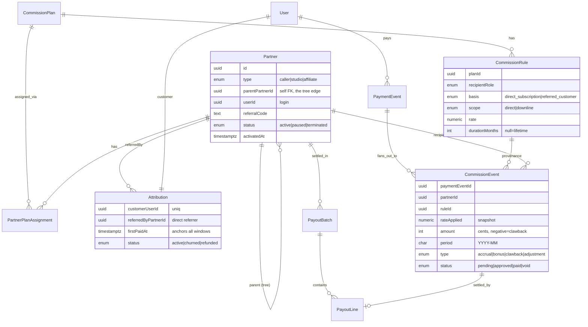
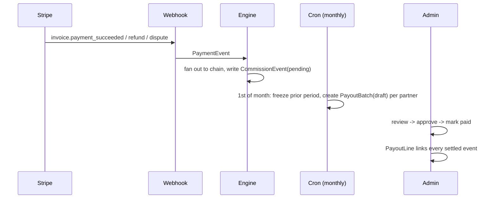

# BaStudio Commission Architecture

Reference spec for the referral + commission system. Written after v1 shipped;
it documents what is live, the target (scalable) design, and the migration
between them.

## Decisions (locked)

- **Commission base = collected gross revenue.** Both the studio's 20% and the
  caller's 18% are calculated on the gross amount Stripe collected on each
  invoice (before Stripe fees, before COGS). Combined first-year partner load on
  a referred customer is therefore 38% of gross. `stripeFee` and `amountNet` are
  still stored per payment so admin reporting shows true net margin.
- **Event-based, never recomputed.** Every commission is a row tied to one
  Stripe payment id; totals are always `SUM(rows)`. The rate is snapshotted on
  the row so later config/plan changes never rewrite history.
- **Forward-only.** Commissions accrue from the moment tracking is live; no
  back-dating of pre-existing subscriptions.

## The comp model

```
Caller ── recruits ──▶ Studio ── refers ──▶ Customer ── pays ──▶ Stripe
```

Three payout streams, all off gross:

| Recipient | Source | Rate | Duration |
| --- | --- | --- | --- |
| Studio | customers the studio refers | 20% | lifetime |
| Caller | the studio's OWN subscription | 18% | 12 mo from studio's first payment |
| Caller | customers referred by that studio | 18% | 12 mo from each customer's first payment |
| Caller | bonus | $50 | per 10 activated studios (cumulative) |

"Activated" = the account completed one full paid month (2nd monthly payment, or
annual + 30 days without refund). Bonuses and qualified-studio counts key off
activation so a card that pays once and refunds never counts.

## Current system (v1, live)

Models: `Caller`, `Influencer` (doubles as Studio; has `callerId`,
`activatedDate`), `ReferredUser` (locks studio + `firstPaymentDate`),
`CommissionEvent` (per-payment ledger, unique on
`(stripePaymentId, recipientType, recipientId, type)`), `CommissionConfig`
(single global row of rates/durations/bonus).

Flow: `/r/CODE` sets the `bas_ref` cookie and records a click; signup writes
`ReferralAttribution` (customer to studio); the Stripe webhook
(`invoice.payment_succeeded`, `charge.refunded`, `charge.dispute.created`)
drives `lib/commission/*` to write ledger rows; a daily cron activates 30-day
payers and credits bonuses; `/admin/commissions`, `/caller`, and the studio
section of `/partner` read the ledger.

Gap vs the comp model: v1 pays the caller on the studio's *referred customers*
but not yet on the studio's *own subscription* (row 2 above). Closed in Phase 1.

## Target system (Phase 2, build when a 2nd plan exists)

Two changes make every future requirement (new %, duration, bonus, tier, or a
per-partner plan) a data insert instead of a migration.

### 1. Rules as data (retire the global config singleton)



### 2. Partner tree (retire separate Caller + Studio tables)

One self-referential `Partner` table. A studio's `parentPartnerId` is its caller.
A customer's payment fans out by walking `parentPartnerId` up from
`Attribution.referredByPartnerId`, matching each ancestor's active rules by
`scope` (direct vs downline) and `basis`. A third tier is a deeper chain plus a
`scope=downline` rule; no schema change.

## Commission calculation (pseudocode)

```
onPayment(paymentEvent):
  attr = Attribution.for(paymentEvent.customerUserId); if !attr: return
  if !attr.firstPaidAt: attr.firstPaidAt = paymentEvent.occurredAt   # lock the clock
  chain = walkUp(attr.referredByPartnerId)                           # [studio, caller, ...]
  for (partner, hop) in chain:
    for rule in activeRules(partner, at=paymentEvent.occurredAt):
      if rule.basis  != basisOf(attr, partner): continue
      if rule.scope == 'direct'   and hop != 0: continue
      if rule.scope == 'downline' and hop == 0: continue
      if !withinWindow(rule.durationMonths, attr.firstPaidAt, paymentEvent.occurredAt): continue
      upsertCommissionEvent(paymentEvent, partner, 'accrual',
        rateApplied=rule.rate, amount=round(gross*rule.rate),
        period=YYYYMM(paymentEvent.occurredAt), status='pending')   # @@unique => idempotent

withinWindow(months, firstPaidAt, now):
  return months is null or now < firstPaidAt + months
```

`active?` is never a stored flag; it is recomputed per payment from
`firstPaidAt + durationMonths`. Refund/dispute => negative `clawback` rows in the
current period. Upgrade/downgrade => next invoice's gross changes, the % tracks
it. Cancel => invoices stop, accruals stop. Reactivate <=90 days => same
`Attribution`, `firstPaidAt` preserved (caller's clock does not restart).

## Payout flow



## Edge cases

| Case | Handling |
| --- | --- |
| Two callers, same studio | `parentPartnerId` set once at creation (admin-only after). Cold-call CRM dedupes before intake. |
| Ownership transfer | Admin changes `parentPartnerId` forward-only; past accruals keep their caller; `AuditLog` records it. |
| Duplicate studios | Unique email; intake idempotent by email; admin merge tool reassigns `Attribution`, voids dupe. |
| Referral dispute | `Attribution` immutable + timestamped + `source`; resolution is an admin override with audit trail, not an edit. |
| Manual override | First-class `adjustment` ledger rows; never hand-edit accruals. |
| Fraud | self-referral block; activation gate; click IP/velocity flags; refund clawback; `pending->approved` review before any payout. |

## Migration path (v1 -> target)

Four independently shippable, reversible steps. Do them only when a real second
plan/tier exists.

1. Introduce `Partner` over `Caller` + `Influencer(callerId)`; backfill
   `parentPartnerId`. Keep `/r`, intake, webhook working throughout.
2. Add `CommissionPlan`/`CommissionRule`; seed one plan reproducing today's exact
   numbers; engine reads rules instead of `CommissionConfig`. Ledger output
   byte-identical.
3. Add `PaymentEvent` normalization + `approved` status + `PayoutBatch` +
   `AuditLog`. Current `CommissionEvent` maps 1:1.
4. Add the studio-own-subscription rule + admin plan/rule editor + transfer/merge
   tools. New plans become a UI action.

## Phase 1 (now): correctness fixes on the live v1

Small, done before any Phase 2 work:

1. **Caller earns 18% on the studio's own subscription** (12 mo from the studio
   account's first payment). Closes the gap above.
2. **Approval gate**: `CommissionEvent.status` gains `approved` between `pending`
   and `paid`, so a payout is a deliberate two-step (approve, then mark paid) and
   a not-yet-approved accrual that later refunds nets out before any cash leaves.
